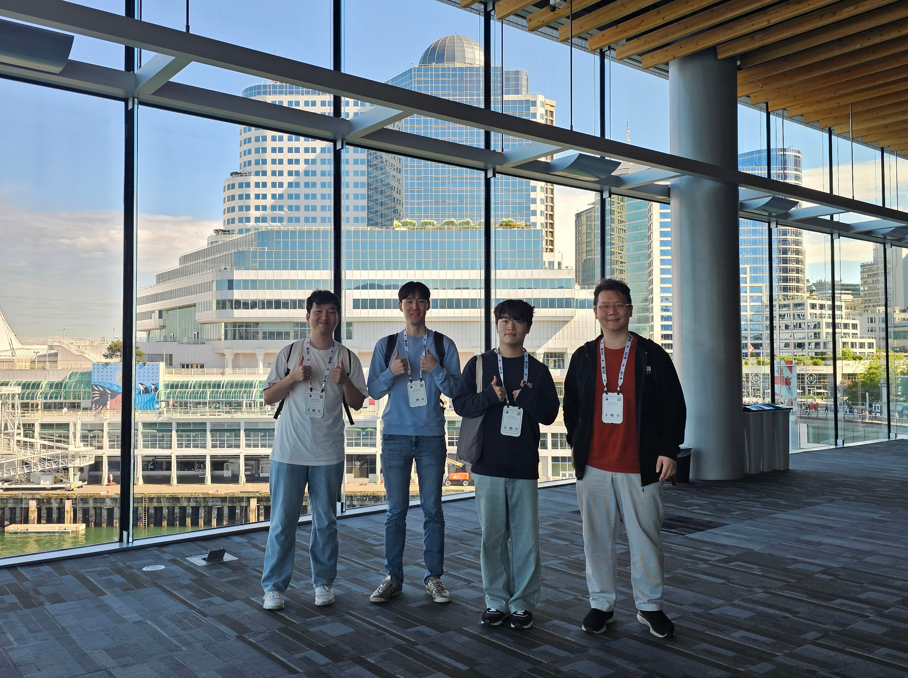

ICML 2025, Vancouver. 

Three students of mine - Jaeheun, Jaehyuk, and Taehun - came along. It would have been much better had all contributors were here with me. 

Last NeurIPS was at the same place. I had the same thought. Back then only Taehun was with me ([recall this](https://aiml-k.github.io/news/24-12-15-concordia/)).
Three feels better. 
I hope, more, next time.

Some more photos to remember we had a blast:

### Main Track: HEGGS

On July 16. This was our first event at ICML 2025.

The poster was huge. We were worried about its size when printing it out, but the board could take it. Everything worked out. 

The crowd was bigger. Jaeheun and Jaehyuk was busy. Very busy.
First cold talks tend to be slow, just like cold-starting a car. But Jaeheun did well. 

Taking photo of the posters. Good sign.

Jaehyuk, rediscovered. Were you this active on stage?

After all that crowd, two guys need some rest. Good job!

### HiLD workshop

TBD

### Terrabytes workshop

TBD

### ML4Audio workshop

TBD
